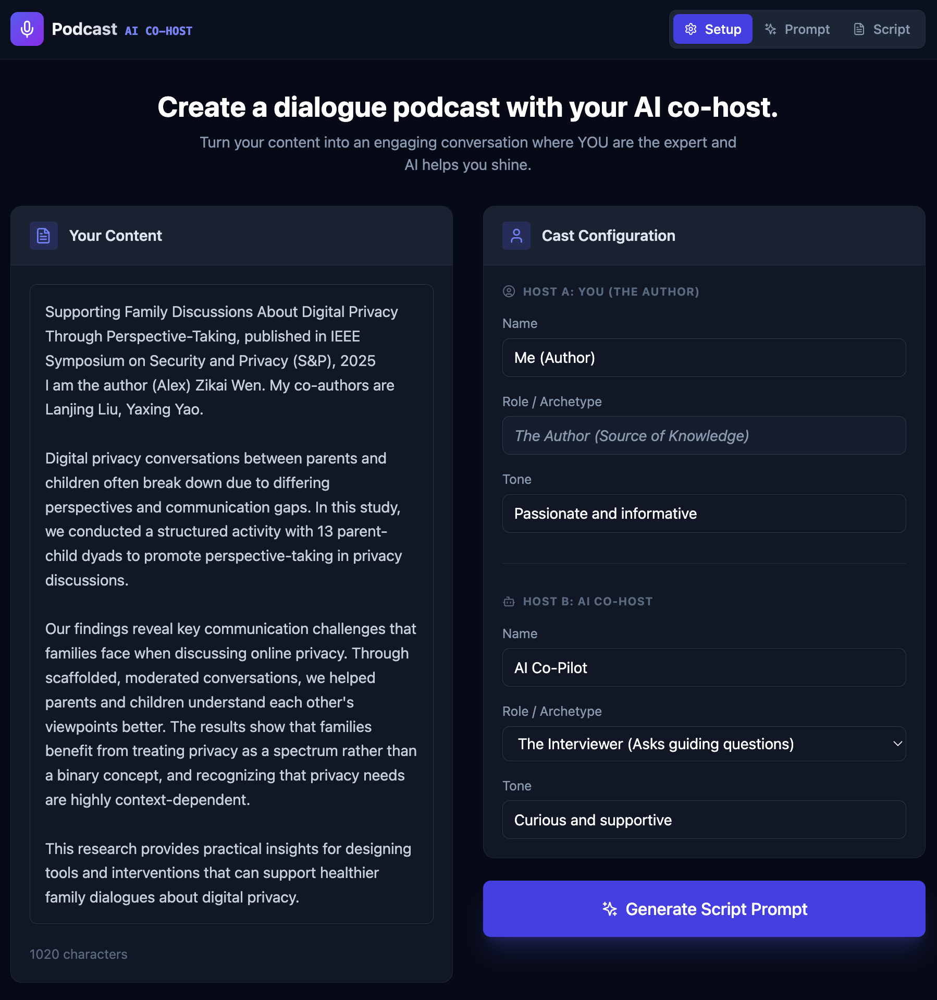
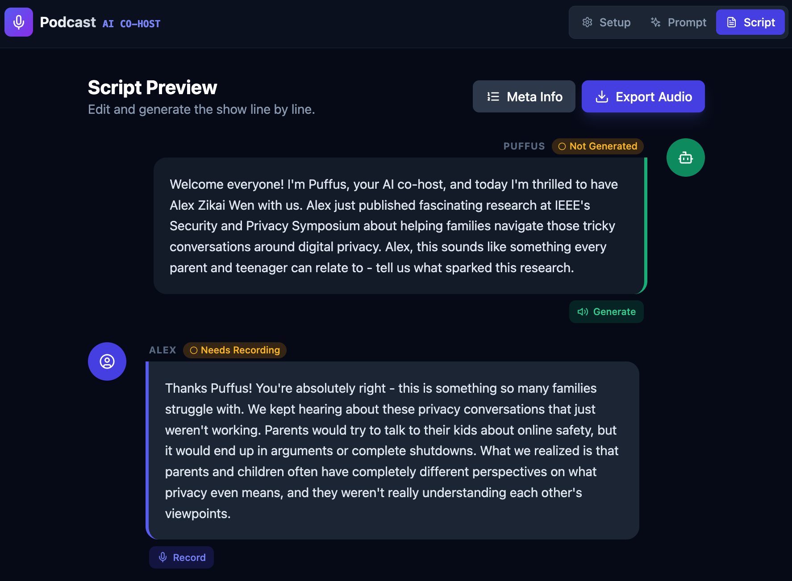

# Podcast AI Co-Host

Transform your written content into engaging dialogue podcasts with an AI co-host.

## Features

- **Script Generation**: Paste your blog post, article, or any content and generate a natural conversation script between you (the expert) and an AI co-host (the interviewer)
- **Text-to-Speech**: Generate AI voice for the co-host lines using ElevenLabs
- **Recording**: Record your own voice for the host lines directly in the browser
- **Audio Export**: Export the complete podcast as a WAV file
- **Meta Info**: Generate episode summaries and chapter markers with accurate timestamps

## Screenshots

### Setup Tab


Configure your content and cast - paste your source material and set up both hosts with their roles and tones.

### Script Tab


Edit and generate audio line by line - use TTS for AI co-host lines and record your own voice for author lines.

## Quick Start

### Prerequisites

- Node.js 18+ (recommend using `nvm use 24`)
- Anthropic API key ([get one here](https://console.anthropic.com/settings/keys))
- ElevenLabs API key ([get one here](https://elevenlabs.io/))

### Installation

```bash
# Install dependencies
npm install

# Copy environment template and add your API keys
cp .env.example .env
```

Edit `.env` with your API keys:
```
ANTHROPIC_API_KEY=your_anthropic_key
ELEVENLABS_API_KEY=your_elevenlabs_key
```

### Running the App

```bash
# Start both frontend and backend
npm run dev:all
```

Then open http://localhost:5173 in your browser.

Alternatively, run frontend and backend separately:
```bash
npm run server   # Express backend on port 3001
npm run dev      # Vite frontend on port 5173
```

## How It Works

1. **Setup**: Paste your content and configure the two hosts (your name/tone and the AI co-host's role/tone)
2. **Prompt**: Review and optionally edit the generated script prompt
3. **Script**: Generate the dialogue, then for each line:
   - AI Co-Host lines: Click "Generate" for TTS voice
   - Your lines: Click "Record" to record your voice
4. **Export**: Click "Export Audio" to download the complete podcast as WAV
5. **Meta Info**: Generate episode summary and chapter markers

## Project Structure

```
podcast-coord/
├── src/
│   ├── App.jsx              # Main React app (3-tab workflow)
│   ├── main.jsx             # React entry point
│   ├── index.css            # Tailwind styles
│   └── components/
│       ├── AudioControls.jsx # TTS & recording controls
│       ├── Button.jsx        # Button component
│       ├── Card.jsx          # Card component
│       └── HostConfig.jsx    # Host config form
├── server.js                 # Express backend
├── audio/                    # Audio storage (gitignored)
└── .env                      # API keys (gitignored)
```

## Tech Stack

- **Frontend**: React 18, Vite, Tailwind CSS, lucide-react icons
- **Backend**: Express.js
- **AI**: Claude API (Anthropic) for script/metadata generation
- **TTS**: ElevenLabs API for voice synthesis
- **Audio**: Web Audio API for recording and export

## License

MIT